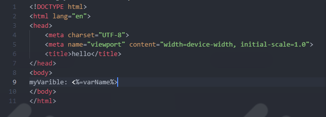

<hr>
<span class="span"># Add Varible ( EJS )</span>
<hr>

<p>1- add in app.get ( {var : 'value',} )</p>

```js
app.get('/',(req,res)=> {
    res.render('starting',{
        var: 'value',
        var2: 'value',
    })
})
```

<p>2- Add In starting.ejs <%=varName%></p>

```html
myVarible: <%=varName%>
```

<p>3- Image</p>
