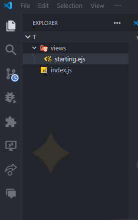

<hr>
<span class="span"># Link Express With Other File ( EJS )</span>
<hr>

<p>1- Use app.set To Set Views Folder</p>

```js
app.set('view engine', 'ejs');
```

<p>2- Add In agg.get ( res.render )</p>

```js
app.get('/',(req,res)=> {
    res.render('starting',{})
})
```

<p>2- Add views Folder In Your Project And starting.ejs File In views Folder</p>



<br>
<hr>
<p style='color:white;font-size:25px'># Code Preview:</p>
<hr><br><br>
<p style='color:white;font-size:25px'># Code: </p>

```js
const app = require('express')();
app.set('view engine', 'ejs');

app.get('/',(req,res)=> {
    res.render('starting',{})


    const port = '3000';
app.listen(port,()=> console.log('express started on port: ',port))
})
```
